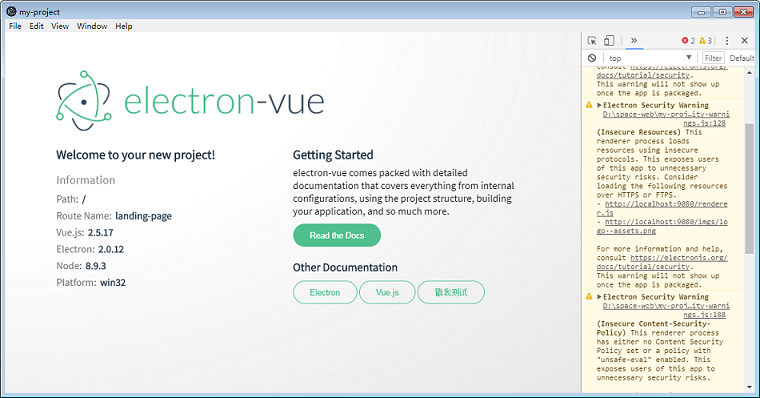
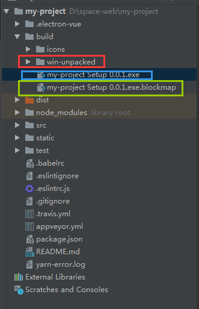

Electron 是一个使用 JavaScript, HTML 和 CSS 等 Web 技术创建原生程序的框架。使用该框架，你可以用web开发出桌面应用。在此介绍一下最基本的搭建。

https://electronjs.org/
## 构建工程
已经出了基于vue-cli的脚手架，可以很方便地搭建基础框架
```js
//安装脚手架
$ npm install -g vue-cli
//构建工程
$ vue init simulatedgreg/electron-vue project-name
//安装依赖
$ cd project-name
//这一步需要耐心，安装失败建议删掉node_modules重新安装
$ npm install
//运行hello world
$ npm run dev
```
## 结果展示
运行成功后会直接启动一个桌面应用


## 正式打包
```js
$ npm run build
```
生成文件如下

* 红色框框内为未打包的windows程序
* 蓝色框框内为可安装的exe文件

