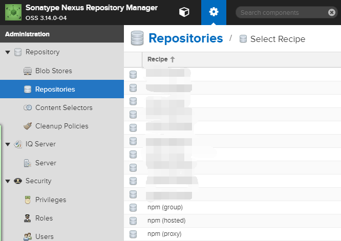
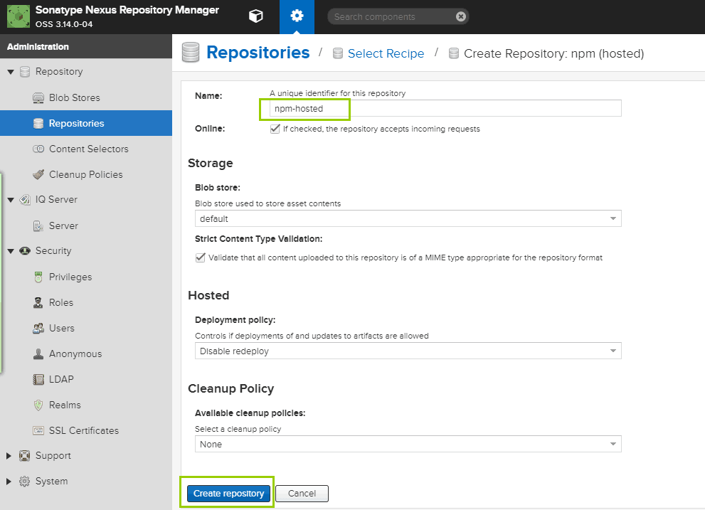
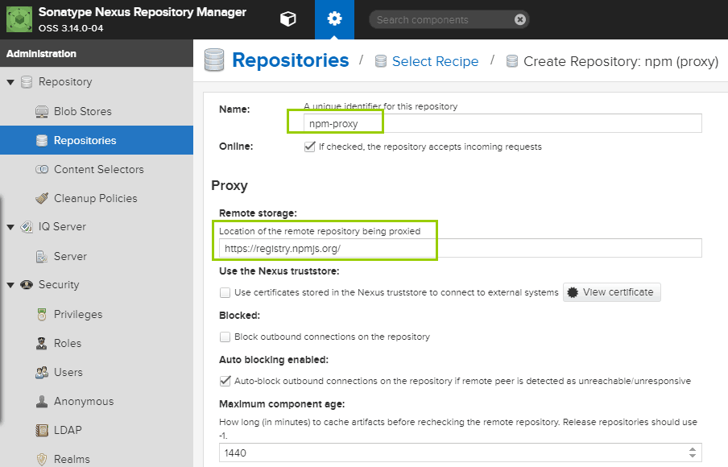
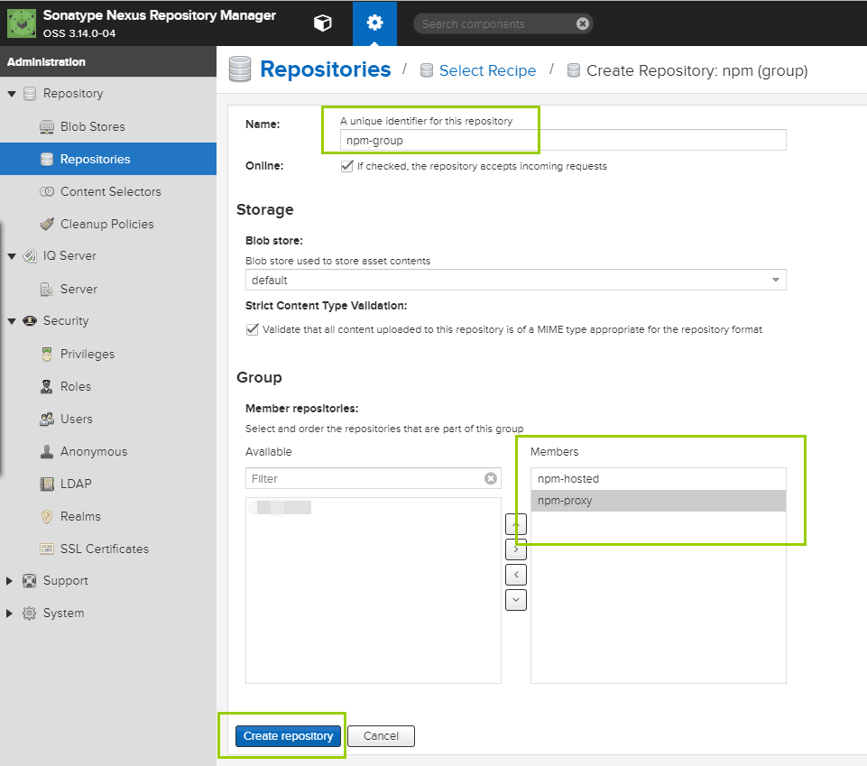
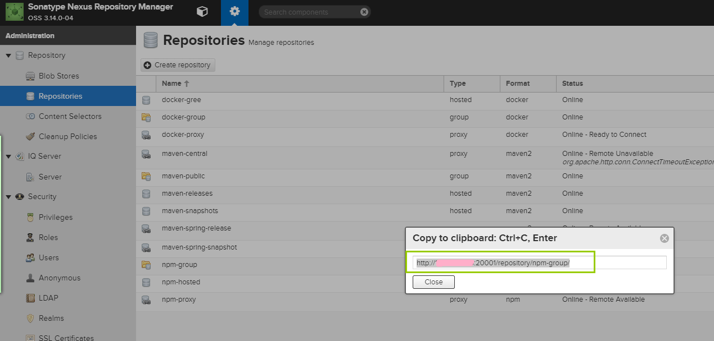

Nexus3搭建npm私服

### 安装Nexus3
自行谷歌，不再赘述。可以安装在本地电脑上，也可以安装在某个服务器（公网或者局域网）上，看你们团队的需求。

我们是安装在一个局域网下的，只有开发人员可以访问。

### 创建npm仓库
* 点击Create Reposity，进入下图


#### 创建本地仓库
* 点击npm(hosted)


#### 代理仓库
* 点击npm(proxy)


#### 组仓库
* 点击npm(group)


### 配置.npmrc文件
* 查看node js默认的仓库地址
```js
npm config get registry
```

* 复制创建的npm(group)地址


* 设置node js仓库地址
```js
npm config set registry [刚刚copy的npm(group)地址]
```

至此搭建完毕，之后你安装的的每一个npm安装包都会上传到配置好的node js仓库中。

###### 参考文章：<a href="https://blog.csdn.net/u010476739/article/details/80210893">使用nexus3搭建npm私服</a>

