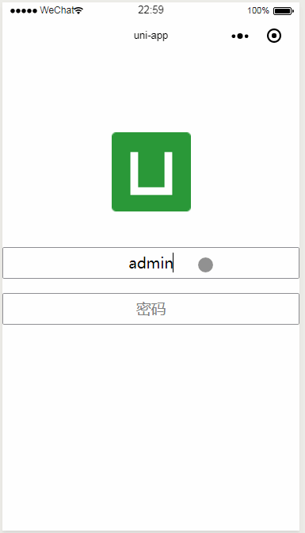

我与小程序二三事

### 背景
最近项目有微信小程序需求，为此做了一番调研，考虑到我们的技术栈偏向于vue，选择了两个框架和原生小程序并做了几个Demo，具体如下。

### 技术选择

#### mpvue介绍
* 美团前端团队出的一个web转小程序框架，包括微信小程序、支付宝小程序、百度小程序、头条小程序
* 维护频率不够高，超过三个月以上没维护了，好害怕烂尾
* mpvue结合vue开发并没有无缝融合，还是挺多坑的
* 缺乏正式的第三方组件库，通过‘偏方’将第三方组件库引入工程中使用
* 官方没有正经的多端Demo

#### mpvue实例演示

#### mpvue相关资料

[mpvue github官方库](https://github.com/Meituan-Dianping/mpvue)

#### uni-app介绍
* DCloud团队出的一个web转多端框架，除了以上四种小程序，还多了android、ios、H5。
* 比mpvue多了三个端的程序，android、ios、H5
* 更新频率相对较高
* 官方有实例Demo，也有挺多网友开发的示例
* 相对mpvue来说，uni-app与vue开发衔接的较为融洽，我更喜欢这个框架多一点
* 有官方组件库

#### uni-app实例演示

#### uni-app相关资料

[官方仓库](https://github.com/dcloudio/uni-app)

#### 微信小程序
* 官方文档详细
* 有官方组件库
* 有学习成本

#### 微信小程序实例演示

#### 微信小程序相关资料
[小程序官方文档](https://developers.weixin.qq.com/miniprogram/dev/framework/)

[bilibili黑马视频（课程较新）](https://www.bilibili.com/video/av40455083?from=search&seid=5706606827510020395)

#### 其他资料

[各大转小程序框架评测](https://mp.weixin.qq.com/s/jIDEHfuMnED6HTfNgjsW4w)

[小程序多端框架全面测评](https://juejin.im/post/5c90eb366fb9a070d4199cc9)

### 实例源码
[三个实例源码地址](https://github.com/susan007/wx-mp-todo)