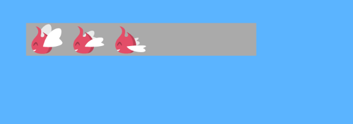
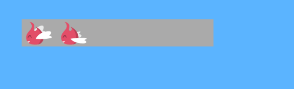
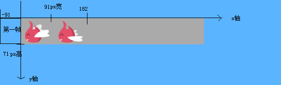
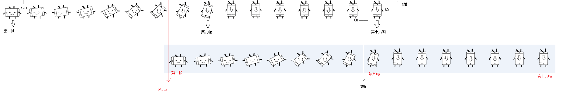
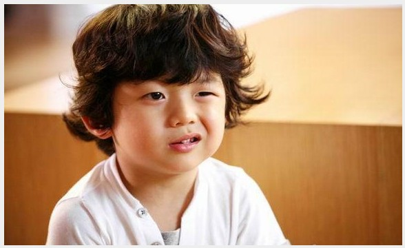

## 背景

上篇文章讲到了雪碧图，其中小机器人抖腿的动作设置了图片的background-position：-640px 循环到-1200px，那么这个数值是如何得出来的？下面具体分析一下如何计算background-position的数值。

## 分析素材

下面这张雪碧图是今天的分析素材，尺寸为273*71，单位是px：


## 概念

background-position：设置背景图像的起始位置。

## 实验分析

#### 1、html代码：设置一个box用于显示图片。

```js
<div class="box"></div>
```

#### 2、css属性设置：

```js
 .box{
            margin-top: 50px;
            margin-left: 50px;
            width: 500px; /*box的宽度 远大于雪碧图宽度*/
            height: 71px; /*box的高度 和雪碧图高度一致*/
            background-image: url(../img/jingling.png); /*将雪碧图置为背景*/
            background-repeat: no-repeat; /*设置背景不重复*/
            background-color: #aaa;
            background-position: 0px 0px; /*设置背景图起始位置为0px 0px */
        }
```

此时界面显示如下：这说明，当 background-position坐标设置为0 0，雪碧图起始位置是和box起始位置重合的。



#### 3、接着设置属性，图片显示如下：

```js
background-position: -91px 0px;
```



我们发现，box起始位置变成了雪碧图的第二张开始。此时再回过头来看看background-position概念：设置背景图像起始位置。把box想象成一个向下向右为正的坐标系，并且box位置保持不动。那么 -91px是该雪碧图在X轴起始位置，可以看到雪碧图的第一帧已经超出box的正坐标系了，所以它看不见了。始终记住一个概念，background-position设置的是雪碧图相对于盒子的起始位置。




#### 4、由此分析一下上一篇的雪碧图位置设置：

机器人雪碧图总共1280*80px，也就是一帧是80*80px。
小机器人的抖腿动作在easy-in进场动画结束之后，此时雪碧图停在最后一帧图上面，也就是有15帧图在坐标系左边，是看不见的。
注意此时要开始机器人抖腿动画，也就是从雪碧图的第9张到第16张执行帧动画。
要把第九帧图显示在坐标系 （0,0）位置，那么雪碧图X轴的起始位置就应该是 -640px，要把第16帧显示在（0,0）位置，那么雪碧图的起始位置就应该是-1200px（保留最后一帧在x轴右边，否则就看不见了）。
坐标值如图所示：



## 结论

始终记住一个概念，background-position设置的是雪碧图相对于盒子的起始位置。



至此，你明白background-position为什么设置为负值了么？
