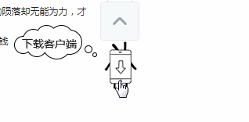

逛哔哩哔哩 ( ゜-゜)つロPC版的时候看到一个蛮有意思的动画，指导用户去下载客户端，于是摸索实现了一个。


## 原动画效果

可以看到，一个静止的小电视人，当鼠标移动到电视人身上时，电视人慢慢变身成为一个小手机人，同时淡入一个对话框提示用户去下载客户端；当鼠标停在小手机人身上时，手机人抖腿，并且对话框持续显示；当鼠标从小手机人身上移开，小手机人慢慢恢复为小电视人，同时对话框淡出退场。




## 实现分析

#### 通过上面的原动画分析出：

机器人进场的动画和出场的动画正好是相反的，只要实现进场动画即可推测出场动画。
对话框有一个淡入淡出的效果。
鼠标停在小人身上时，小人有个抖腿动作和箭头上下浮动的动作。
这些动作变化用到雪碧图实现。雪碧图文件如下：


## 代码分析

#### html代码
很简单的两句。引入一个div空间用于展示图片，引入一个div用于展示下载对话框。

```js
<div id="elevator-mobile-app" class="app-icon" style="background-position-x: 0px;"></div>
<div id="cloud" class="cloud">下载手机客户端</div>
```
　　

#### css淡入动画代码

#### 关键点解读：

* animation-timing-function：检索或者设置动画过渡类型，这里用到了steps阶跃函数，也就是说这个动画不需要补间过渡，只要一帧帧显示就行。steps函数两个参数，第一个是指定间隔数n，即分n步阶段性展示；第二个参数设置最后一步的状态，可取值start或者end,默认为end。我们的雪碧图一共16张小图，有15个间隔，所以参数为steps(15)。

* @keyframes:指定动画名称或动画效果。0%指的是在指定的时间段1.5s中的时间点，即0s的时候；100%同理即1.5s的时候。在此我们改变的是background-position属性，也就是移动雪碧图。

```js
.easy-in {
    animation-timing-function: steps(15);
    animation-name: phone-in;
    animation-duration: 1.5s;
    animation-iteration-count: 1;
    animation-fill-mode: forwards;
    background-position: left;
}
@keyframes phone-in {
     0% {
         background-position: left;
     }

     100% {
         background-position: right;
     }
 }
 ```
　　

#### 小手机人抖腿动作，关键点解读：

* 观察到是手机人的动作，基本是竖着的，猜测是从第九帧到第16帧图，所以步数设为steps(7)。
* 此时雪碧图已经执行完一遍，想象box起始位置为一个向右向下为正的坐标系，此时只有最后一帧图在坐标轴右边，所以雪碧图起始位置距离box起始位置是负的。
* 雪碧图总长度1280px，总共16张，得出每张小图80px。那第九帧图在坐标轴右边的时候，雪碧图起始位置是 -80*8 = -640px。
* 同理得出第16帧图在坐标轴右边时，雪碧图起始位置距离box起始位置是 -80*15 = -1200px。

```js
 .easy-over {
            animation-timing-function: steps(7,start);
            animation-name: phone-over;
            animation-duration: 0.8s;
            animation-iteration-count: infinite;
            animation-fill-mode: forwards;
            background-position: -640px;
        }

        @keyframes phone-over {
            0% {
                background-position: -640px 50%;
            }

            100% {
                background-position: -1200px ;
            }
        }
```
　　

#### javascript 鼠标事件代码如下：

```js
var phoneDom=$('#elevator-mobile-app');
var cloudDom=$('#cloud');

phoneDom.mouseenter(function () {
    //添加雪碧图进场效果
    if(phoneDom.hasClass('easy-out')){
        phoneDom.removeClass('easy-out');
    }
    phoneDom.addClass('easy-in');
    //执行完动画开始循环从第九张雪碧图开始循环执行抖腿动作
    setTimeout(function () {
        phoneDom.removeClass('easy-in');
        phoneDom.addClass('easy-over');
    },1500);
    //添加对话云朵淡进效果
    if(cloudDom.hasClass('mFadeOut')){
        cloudDom.removeClass('mFadeOut');
    }
    cloudDom.addClass('mFadeIn');
    cloudDom.css('opacity','1');
})


phoneDom.mouseleave(function () {
    //添加雪碧图出场效果
    if(phoneDom.hasClass('easy-in')){
        phoneDom.removeClass('easy-in');
    }
    if(phoneDom.hasClass('easy-over')){
        phoneDom.removeClass('easy-over');
    }
    phoneDom.addClass('easy-out');
    //添加云朵淡出效果
    if(cloudDom.hasClass('mFadeIn')){
        cloudDom.removeClass('mFadeIn');
    }
    cloudDom.addClass('mFadeOut');
    cloudDom.css('opacity','0');
})
```

　js事件主要用到了两个鼠标事件mouseenter和mouseleave，很简单。鼠标移入时触发mouseenter，此时给图片添加进场效果，给对话框添加淡入效果；鼠标移出时触发mouseleave事件，此时移除入场效果，添加出场效果。


## 效果展示


最后奉上完整代码地址： https://gitee.com/susan007/bilibili-demo
