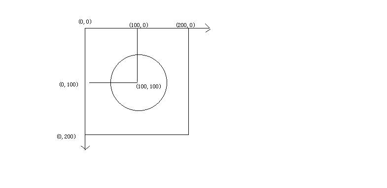
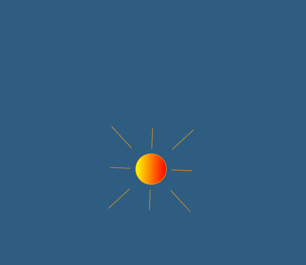

## 效果分析

一个太阳，从底部升起来，天空由黑变蓝。那么要画的东西确定为三个：
* 太阳（圆形）
* 太阳光芒
* 天空


## 代码如下

```js
<!--画太阳-->
<svg width="600" height="600">
    <!--天空和天空颜色动画-->
    <rect width="100%" height="100%"
          style="fill:rgb(8,8,88)">
        <animate attributeName="fill" from="black" to="#5bb4ff" begin="0s" dur="3s" repeatCount="indefinite" />
    </rect>
    <!--太阳颜色 采用渐变色-->
    <linearGradient id="grad1" x1="0%" y1="0%" x2="100%" y2="0%">
        <stop offset="0%" style="stop-color:rgb(255,255,0);stop-opacity:1" />
        <stop offset="100%" style="stop-color:rgb(255,0,0);stop-opacity:1" />
    </linearGradient>
    <g>
        <!--太阳的光芒-->
        <line x1="100" y1="20" x2="100" y2="60" style="stroke: orange"/>
        <line x1="20" y1="100" x2="60" y2="100" style="stroke: orange"/>
        <line x1="140" y1="100" x2="180" y2="100" style="stroke: orange"/>
        <line x1="100" y1="140" x2="100" y2="180" style="stroke: orange"/>
        <line x1="20" y1="20" x2="60" y2="60" style="stroke: orange"/>
        <line x1="140" y1="140" x2="180" y2="180" style="stroke: orange"/>
        <line x1="180" y1="20" x2="140" y2="60" style="stroke: orange"/>
        <line x1="20" y1="180" x2="60" y2="140" style="stroke: orange"/>

        <!--太阳-->
        <circle cx="100" cy="100" r="30" stroke="orange" fill="url(#grad1)"/>

        <!--太阳升起来整体运动-->
        <animateMotion path="M20,200 q160,180 360,30" begin="0s" dur="3s" rotate="auto" repeatCount="indefinite"/>
    </g>
    <!--<path d="M20,200 q160,180 360,30" stroke="#cd0000" stroke-width="2" fill="none" />-->
</svg>
```

#### 关键点分析

* 天空颜色动画：使用了动画animate ，将天空填充颜色fill，从黑色变为蓝色，持续时间三秒。
* 太阳填充颜色：使用了线性渐变linearGradient。
* 太阳光芒坐标计算：将太阳和光芒设定在一个200*200的正方形中，太阳位于正中央，光芒位置很容易计算。

* 太阳整体运动轨迹：使用路径动画animateMotion 随便画了一个二次贝塞尔曲线，注意设定rotate="auto"，这样元素就会按照路径曲线的切线方向自动调整运动角度。


## 最终效果



