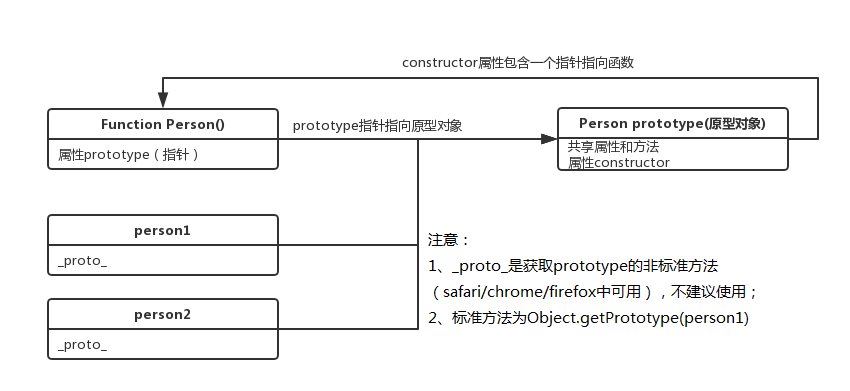
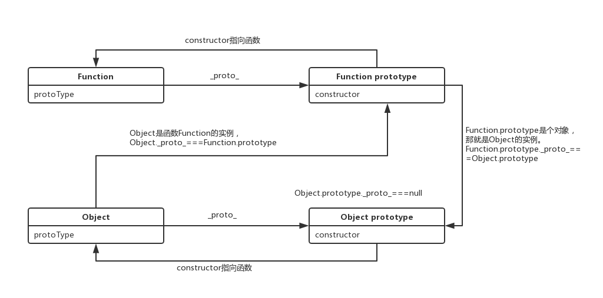
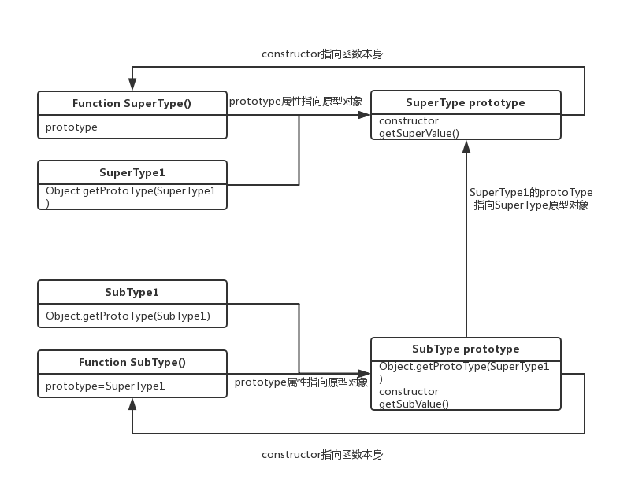

## 写作背景

最近在抓基础，毕竟没有好地基盖楼容易塌啊...再回首javascript，原型可以说是该语言较为核心的设计之一，我们有必要了解下其设计理念 (#^.^#)

## 基本概念

* MyObject.prototype：用于建立由new MyObject()创建的对象的原型。
* _proto_：获取obj对象的原型对象的非标准方法（只在某些浏览器支持，如chrome/safari/firefox）。
* Object.getPrototype(obj)：获取obj原型对象的标准方法。
* 原型对象：包含由特定类型的所有实例共享的属性和方法；prototype正指向这个对象。
* constructor：每个系统默认，注意系统默认的原型对象都有一个constructor属性，指向其构造函数。


## 原型对象图解



#### 说明

* 每个函数都有一个prototype属性，指向原型对象。
* 原型对象默认取得一个constructor属性，这个属性包含一个指向prototype属性所在函数的指针。
* 构造函数创建的每个实例中包含一个[[prototype]]指针，指向构造函数的原型对象。（备注：这个指针的标准访问方式为Object.prototype(obj)，非标准访问方式为_proto_）


## Object、Function和原型关系




#### 说明

* 首先Object和Function都是构造函数，而所有的构造函数的都是Function的实例对象. 因此Object是Function的实例对象。
* Function.prototype原型对象是Object的实例对象。
* 实例对象的原型(我们以proto来表示)会指向其构造函数的prototype属性, 因此```Object.proto ===Function.prototype,Function.proto===Function.prototype,Function.prototype.proto === Object.prototype```
* 当我们访问一个属性值的时候, 它会沿着原型链向上查找, 直到找到或者到Object.prototype.proto(为null)截止。


## 原型链实现继承



#### 本图参考实现代码见javascript高级程序设计

```js
function SuperType(){
  this.property = true
}

SuperType.prototype.getSuperValue = function(){
  return this.property
}

function SubType(){
  this.subproperty = false
}

//继承了SuperType
SubType.prototype = new SuperType()
SubType.prototype.getSubValue = function (){
  return this.subproperty
}

var instance = new SubType()
alert(instance.getSuperValue())//true
```

## 原型链弊端

在通过原型来实现继承时，原型实际上会变成另一个类型的实例。于是，原先的实例属性也就顺理成章地变成了现在的原型属性了。
没有办法在不影响所有对象实例的情况下，给超类型的构造函数传递参数。


希望文章对小伙伴有所帮助，也非常欢迎指出文章存在问题，emmmmmmmmmm......


