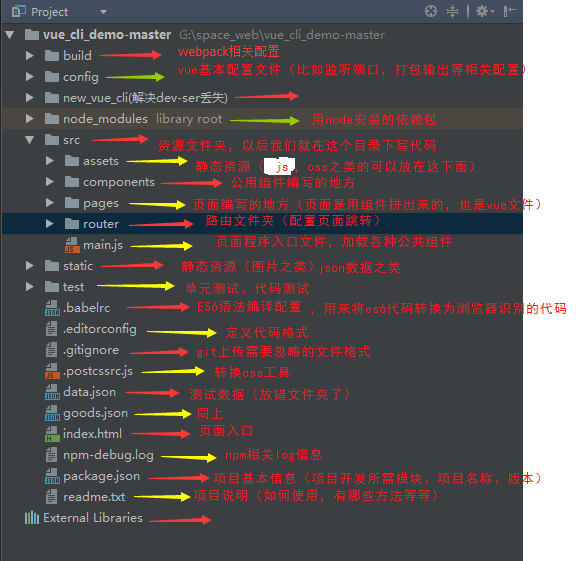

## 背景

最近在学习vue，看的稀里糊涂。今天从头开始，把cli配置的vue项目目录和配置文件搞清楚。

## 结构

#### 项目整体目录结构


#### build文件夹下相关文件及目录


#### config文件夹下目录和文件


接下来说说vue-cli项目中页面相关的主要文件^o^

#### 首先是index.html

说明：一般只定义一个空的根节点，在main.js里面定义的实例将挂载在#app节点下，内容通过vue组件填充。


#### App.vue文件

说明：app.vue是项目的主组件，所有页面都是在app.vue下切换的。一个标准的vue文件，分为三部分。

* 第一装写html代码在```<template></template>```中，一般在此下面只能定义一个根节点；
* 第二```<script></script>```标签；
* 第三```<style scoped></style>```用来写样式，其中scoped表示。该style作用于只在当前组件的节点及其子节点，但是不包含子组件呦。

```<router-view></router-view>```是子路由视图，后面的路由页面都显示在此处，相当于一个指示标，指引显示哪个页面。


#### main.js

说明：入口文件来着，主要作用是初始化vue实例并使用需要的插件。比如下面引用了4个插件，但只用了app（components里面是引用的插件）。


#### router下面的index.js文件：路由配置文件

说明：定义了三个路由，分别是路径为/，路径为/msg，路径为/detail。后续会详细说明，因为我也是才学好多东西不懂，囧。


下一篇会继续详解build文件夹、config文件夹以及package.json等配置相关的文件。


