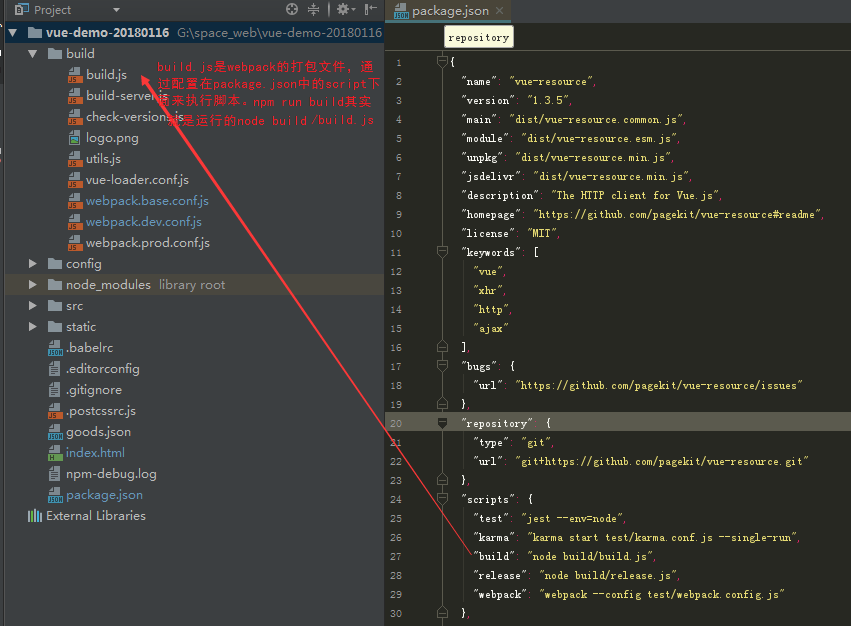
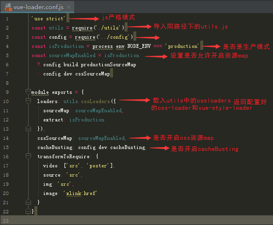

好，接下来一起分析分析配置文件^o^。

## 文件详情
#### build.js作用：命令npm run build的入口配置文件，主要用于生产环境。


#### build.js中具体含义标注（vue-cli脚手架官方文件解释，大家可自行定制这里面的内容）：


#### check-version.js，文件有点点长这里直接贴代码：

```js
'use strict' //js严格运行模式
const chalk = require('chalk') //导入chalk模块，const声明一个常量
const semver = require('semver') //同上
const packageConfig = require('../package.json') //导入package.json文件
const shell = require('shelljs')//shelljs插件，执行unix系统命令

function exec (cmd) {
//脚本可以通过child_process模块新建子进程，从而执行Unix系统命令
  return require('child_process').execSync(cmd).toString().trim()//将cmd参数传递的值转换成前后没有空格的字符串，也就是版本号
}
//声明常量数组，数组内容为有关node相关信息的对象
const versionRequirements = [
  {
    name: 'node',//对象名称为node
    currentVersion: semver.clean(process.version),//使用semver插件，把版本信息转换成规定格式
    versionRequirement: packageConfig.engines.node//规定package.json中engines选项的node版本信息
  }
]

if (shell.which('npm')) {//which为linux指令，在$path规定的路径下查找符合条件的文件
  versionRequirements.push({
    name: 'npm',
    currentVersion: exec('npm --version'),//调用npm --version命令，并且把参数返回给exec函数获取纯净版本
    versionRequirement: packageConfig.engines.npm//规定package.json中engines选项的node版本信息
  })
}

module.exports = function () {
  const warnings = []

  for (let i = 0; i < versionRequirements.length; i++) {
    const mod = versionRequirements[i]
　　//如果版本号不符合package.json文件中指定的版本号，就执行warning.push...
    if (!semver.satisfies(mod.currentVersion, mod.versionRequirement)) {
      warnings.push(mod.name + ': ' +
        chalk.red(mod.currentVersion) + ' should be ' +
        chalk.green(mod.versionRequirement)
        //当前版本号用红色标识，要求版本号用绿色标识
      )
    }
  }

  if (warnings.length) {//如果为真，则打印提示用户升级新版本
    console.log('')
    console.log(chalk.yellow('To use this template, you must update following to modules:'))
    console.log()

    for (let i = 0; i < warnings.length; i++) {
      const warning = warnings[i]
      console.log('  ' + warning)
    }

    console.log()
    process.exit(1)
  }
}
```


#### utils.js还是需要贴代码，太长了：

```js
'use strict'//js严格模式执
const path = require('path')//导入path模
const config = require('../config')//引入config目录下的index.js配置文件
const ExtractTextPlugin = require('extract-text-webpack-plugin')//一个插件，抽离css样式，防止将样式打包在js中引起样式加载错乱
const packageConfig = require('../package.json')
//导出assetsPath
exports.assetsPath = function (_path) {
//如果是生产环境，则assetsSubDirectory的值为index.js文件中的assetsSubDirectory的值，否则...
  const assetsSubDirectory = process.env.NODE_ENV === 'production'
    ? config.build.assetsSubDirectory
    : config.dev.assetsSubDirectory

  return path.posix.join(assetsSubDirectory, _path)//path.join返回绝对路径（在电脑上的实际位置）；path.posix.join返回相对路径
}
//cssloaders相关配置
exports.cssLoaders = function (options) {
  options = options || {}

  const cssLoader = {
    loader: 'css-loader',//loader还是看看webpack官方解释，处理除js之外的文件？
    options: {//传递参数给loader
      sourceMap: options.sourceMap//是否开启cssmap,默认为false
    }
  }
//postcss-loader相关
  const postcssLoader = {
    loader: 'postcss-loader',
    options: {
      sourceMap: options.sourceMap
    }
  }

  // generate loader string to be used with extract text plugin
  function generateLoaders (loader, loaderOptions) {
    const loaders = options.usePostCSS ? [cssLoader, postcssLoader] : [cssLoader]//是否使用postCss

    if (loader) {
      loaders.push({
        loader: loader + '-loader',//加载对应loader
        options: Object.assign({}, loaderOptions, {//object.assign浅拷贝合并对象
          sourceMap: options.sourceMap
        })
      })
    }

    // Extract CSS when that option is specified
    //
    if (options.extract) {
      return ExtractTextPlugin.extract({
        use: loaders,
        fallback: 'vue-style-loader'
      })
    } else {
      return ['vue-style-loader'].concat(loaders)
    }
//返回最终读取和导入loader
  }

  // https://vue-loader.vuejs.org/en/configurations/extract-css.html
  return {
    css: generateLoaders(),//css对应vue-style-loader和css-loader
    postcss: generateLoaders(),//postcss对应vue-style-loader和less-loader
    less: generateLoaders('less'),//less对应...(同上）
    sass: generateLoaders('sass', { indentedSyntax: true }),
    scss: generateLoaders('sass'),
    stylus: generateLoaders('stylus'),
    styl: generateLoaders('stylus')
  }
}

// Generate loaders for standalone style files (outside of .vue)
exports.styleLoaders = function (options) {
  const output = []
  const loaders = exports.cssLoaders(options)
//生成的各种css文件的loader对象
  for (const extension in loaders) {
    const loader = loaders[extension]//提取每一种文件的loader
    output.push({
      test: new RegExp('\\.' + extension + '$'),
      use: loader
    })
  }

  return output
}

exports.createNotifierCallback = () => {
  const notifier = require('node-notifier')//导入模块，用于node.js模块发送跨平台系统通知

  return (severity, errors) => {
    if (severity !== 'error') return

    const error = errors[0]
    const filename = error.file && error.file.split('!').pop()

    notifier.notify({
      title: packageConfig.name,//发生错误时的通知标题
      message: severity + ': ' + error.name,
      subtitle: filename || '',
      icon: path.join(__dirname, 'logo.png')//发生错误时的通知图标
    })
  }
}
```

#### vue-loader.config.js


这篇好长啊，先结束了，下一篇再介绍重要的几个文件：webpack.base.conf.js     webpack.dev.conf.js     webpack.prod.conf.js     webpack.test.conf.js
