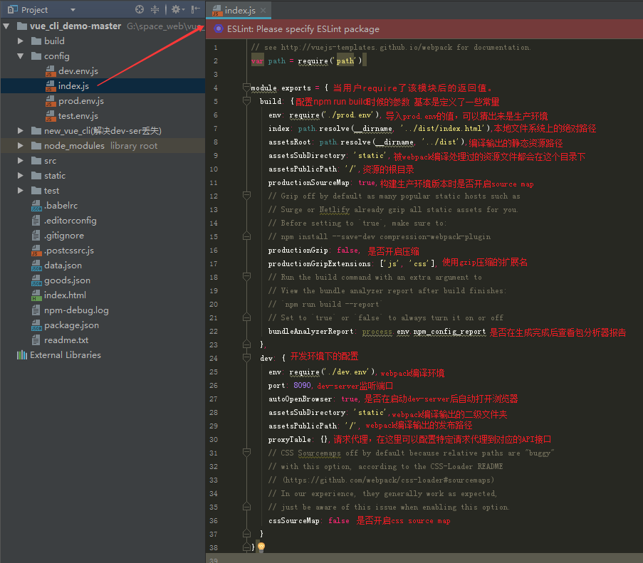
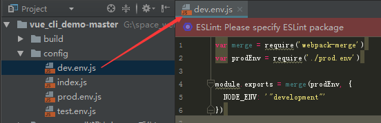
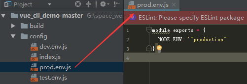
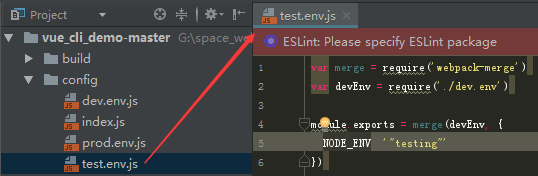
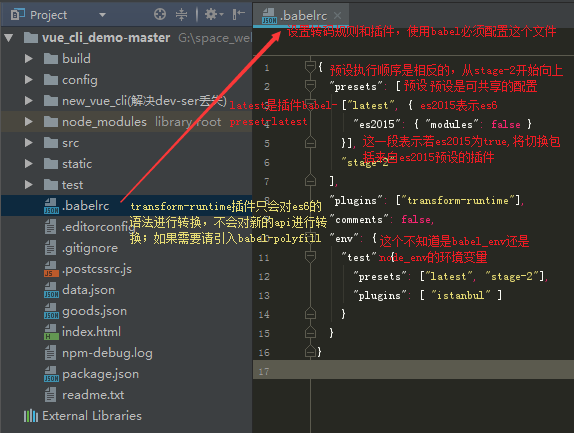
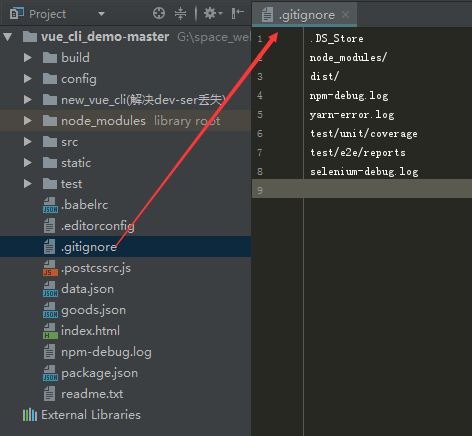
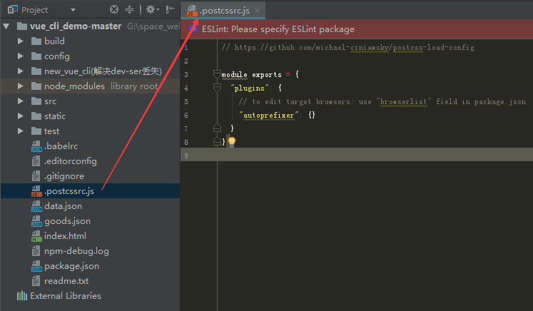

好了，脚手架目录中重要的文件基本都介绍了，但还有一个不太注意到的文件没有解释，这里也说明一下。

#### config文件夹下的index.js，作用是不同开发环境下的参数配置（可选项很多，生产环境、开发环境、测试环境）：



condig文件夹中的其他几个文件，这几个文件主要是暴露接口（其他文件会引用这些暴露出来的变量等）：








#### .babelrc文件：由于浏览器的兼容问题，很多js新方法都不能用，babel因此而生。它可以将这些新方法编译成兼容的代码，尽量多的适应主流浏览器。

#### 想要深入了解可以去巴别官网查看详细配置和解释。官网地址： https://babeljs.io/docs/plugins/



#### .editorconfig文件配置：用来规范开发中缩进风格的统一


#### editorConfig相关参数：

| 通配符 | 含义 |
| ------ | ------ |
| *                | 匹配除/之外的任意字符串 |
| **               | 匹配任意字符串 |
| ?                | 匹配任意单个字符 |
| [name]           | 匹配name中的任意一个单一字符 |
| [!name]          | 匹配不存在name中的任意一个单一字符 |
| {s1,s2,s3}       | 匹配给定的字符串中的任意一个(用逗号分隔) |
| {num1..num2}   　| 匹配num1到num2之间的任意一个整数, 这里的num1和num2可以为正整数也可以为负整数 |

| 属性 | 含义 |
| ----- | ----- |
| indent_style    | 设置缩进风格(tab是硬缩进，space为软缩进)|
| indent_size     | 用一个整数定义的列数来设置缩进的宽度，如果indent_style为tab，则此属性默认为tab_width|
| tab_width       | 用一个整数来设置tab缩进的列数。默认是indent_size|
| end_of_line     | 设置换行符，值为lf、cr和crlf|
| charset         | 设置编码，值为latin1、utf-8、utf-8-bom、utf-16be和utf-16le，不建议使用utf-8-bom|
| trim_trailing_whitespace  | 设为true表示会去除换行行首的任意空白字符。|
| insert_final_newline      | 设为true表示使文件以一个空白行结尾|
| root        　　　| 表示是最顶层的配置文件，发现设为true时，才会停止查找.editorconfig文件|

#### .gitignore文件：用来配置不需要加在版本管理中的文件，忽略git不必要提交文件。


以下摘自廖雪峰老师的博客：

> 忽略文件的原则是：

* 忽略操作系统自动生成的文件，比如缩略图等；
* 忽略编译生成的中间文件、可执行文件等，也就是如果一个文件是通过另一个文件自动生成的，那自动生成的文件就没必要放进版本库，比如Java编译产生的.class文件；
* 忽略你自己的带有敏感信息的配置文件，比如存放口令的配置文件。

下面我们看看常用的规则：
```js
1）/mtk/               过滤整个文件夹
2）*.zip                过滤所有.zip文件
3）/mtk/do.c         过滤某个具体文件
这里很有意思~

需要注意的是，gitignore还可以指定要将哪些文件添加到版本管理中：
1）!*.zip
2）!/mtk/one.txt

唯一的区别就是规则开头多了一个感叹号，Git会将满足这类规则的文件添加到版本管理中。
为什么要有两种规则呢？想象一个场景：假如我们只需要管理/mtk/目录中的one.txt文件，这个目录中的其他文件都不需要管理，那么我们就需要使用：
1）/mtk/
2）!/mtk/one.txt

说明：如果你不慎在创建.gitignore文件之前就push了项目，那么即使你在.gitignore文件中写入新的过滤规则，这些规则也不会起作用，Git仍然会对所有文件进行版本管理。因此一定要养成在项目开始就创建.gitignore文件的习惯，否则一旦push，处理起来会非常麻烦。
```

.postcssrc.js文件：postCss提供一个解析器，将css解析成抽象语法树。



再来一段解释，觉得写得不错：

> 如果Sass等预编译器是新定义了一种模板语言，然后将其转化为css的话，PostCSS则是更纯粹地对css本身做转换。
回想一下你是如何学习使用css预编译器的：了解到有这样一种可以转化为css的语言，它有很多特性，变量、嵌套、继承等等，每一种特性都通过一定语法实现。大概就像是递给你一个已经封装好的工具箱（量产型？），你可以在里面找有用的东西。
那PostCSS是怎样呢？PostCSS就像只递给你一个盒子，但告诉你你可以从旁边的陈列柜取走自己想要的工具放进盒子打包带走。如果你觉得陈列柜里的不够好，PostCSS还可以帮你打造你自己的工具。所以，使用PostCSS，你可以仅取所需。

插件官方链接： https://www.npmjs.com/package/postcss


额 终于把vue-cli全部文件介绍完毕 接下来要考虑这些文件之间的关联了...
